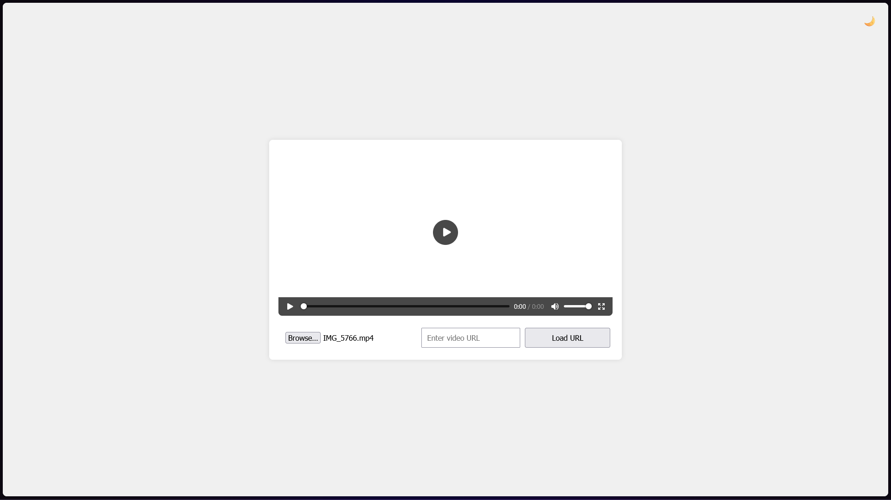
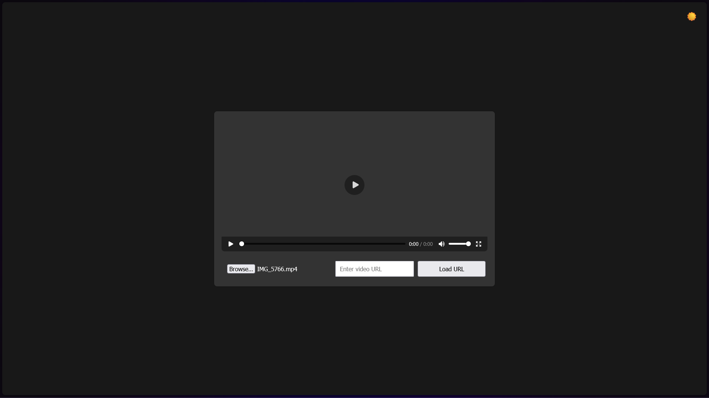

# `Generated by AI`
# Web Video Player

This project is a simple web video player that allows users to upload a local video file or play a video from a URL. It also includes a light/dark mode toggle feature.

## Features

- Upload and play local video files
- Play videos from a URL
- Toggle between light and dark modes

## Setup

1. Clone or download the project files to your local machine.
2. Open the `index.html` file in your web browser.

## File Structure

- `index.html`: The main HTML file that contains the structure of the web video player.
- `styles.css`: The CSS file that contains styles for the web video player.
- `script.js`: The JavaScript file that handles video file uploads, URL loading, and theme toggling.

## Usage

1. Open the `index.html` file in your web browser.
2. Use the file input to upload a local video file or enter a video URL in the text input and click the "Load URL" button.
3. Use the theme toggle button (🌙/☀️) to switch between light and dark modes.

## Screenshots

### Light Mode

### Dark Mode

## License

This project is licensed under the MIT License.
